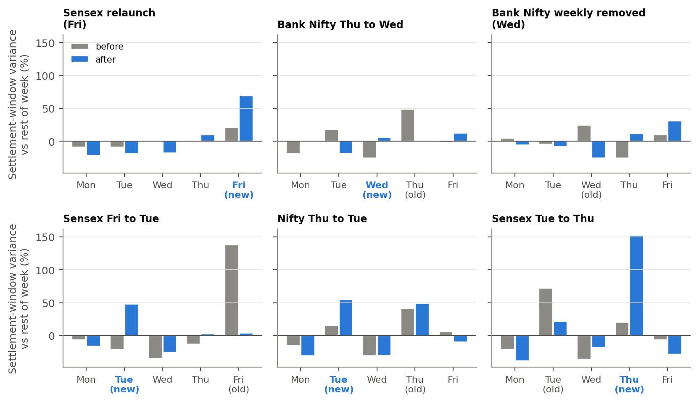
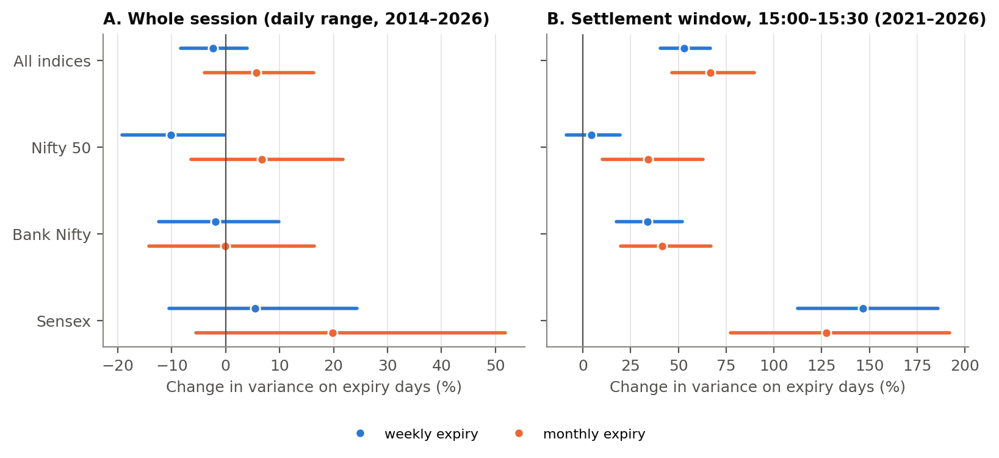

# Expiry Moves the Close, Not the Day

[](https://github.com/vicky123411/india-options-expiry-effects/actions/workflows/tests.yml)
[](LICENSE)

Research code for **"Expiry Moves the Close, Not the Day: Natural Experiments from India's Changing Options Expiry Calendar"** (paper in [`paper/main.pdf`](paper/main.pdf)).

**The question:** do index options expiries make India's stock market more volatile?

**The trick:** between 2016 and 2025 the exchanges moved the expiry weekday of index options eleven times. For example:
- Bank Nifty: Thursday → Wednesday in 2023.
- Sensex: Friday → Tuesday → Thursday in 2025.
- Nifty: Thursday → Tuesday in Sept 2025.

If expiry causes volatility, the volatile day should **move when the expiry day moves**.

## Key findings
| | Weekly expiry days | Monthly expiry days |
|---|---|---|
| Whole trading day (daily data, 2014–2026) | **−2.4%** variance (95% CI −8% to +4%) | +5.7% (CI −4% to +16%) |
| Whole trading day (5-minute data, 2021–2026) | +2% (not significant) | +10% (not significant) |
| **Last 30 minutes, 15:00–15:30** (1-minute data, 2021–2026) | **+53%** (CI +40% to +67%) | **+67%** (CI +47% to +90%) |

- **The day as a whole is at most slightly riskier on expiry days.** The pooled estimates are close to zero. Event windows around the calendar changes give about +15%, so modest whole-day effects can't be ruled out.
- **The settlement window is.** Until 3 Aug 2026 the 15:00–15:30 average price set the closing value used to settle expiring options. On expiry days that half hour's variance is about 50–70% higher. For Sensex it is about 150% higher.
- **The effect follows the calendar.** Six calendar changes have minute data:
  - In all five changes that gave a weekday a new expiry, that weekday's last half hour became more volatile.
  - In four of the five that took an expiry away, it became calmer. The exception is Nifty's Thursday, which got Sensex's expiry the same day.
  - Stacked over the six changes: new weekday **+65%**, old weekday **−31%**.
  - In the pooled regressions, none of 1,000 placebo calendars gives a last-half-hour effect as large (p = 0.001).
- **Regulation has not removed it.** The effect stayed large after SEBI's Nov 2024 measures (somewhat lower point estimates) and was largest after its July 2025 interim order.
- **Little pinning to strikes.**
- **One suggestive reversal pattern:** on Bank Nifty expiry days in 2023–25 (the period of SEBI's allegations), the last half hour tended to reverse the day's move. This test was chosen to match the allegations, so treat it as suggestive.
- **No forecasting gain.** Adding the expiry calendar to paper 1's HAR model does not improve next-day volatility forecasts.





## How it works
- **Expiry calendar:** [`expiryvol/expiries.py`](expiryvol/expiries.py) holds every rule of six option products, 2014–2026, plus the holiday rule.
  - It matches NSE's own contract files on **all 932** Nifty and Bank Nifty expiry days (0 mismatches).
  - It also matches all 148 Sensex expiry dates in an independent option dataset.
- **Volatility measures:**
  - Garman–Klass daily range (as in paper 1).
  - Realized variance from 5-minute returns.
  - Realized variance of 1-minute returns in 15:00–15:30.
  - Realized variance of each 15-minute slot of the day.
- **Main comparison:** each expiry day is compared with the same index in the same week, and with that index's normal weekday pattern. So an effect is identified only by days whose expiry status changed (calendar switches and holiday shifts) — a difference-in-differences.
- **Checks:**
  - event-by-event and stacked event studies;
  - weekday × year and date fixed effects;
  - Driscoll–Kraay errors;
  - holiday controls;
  - 1,000 placebo calendars (randomization inference).
  - Every check was listed in [`ANALYSIS_PLAN.md`](ANALYSIS_PLAN.md) before it was run.
- **Mechanisms:**
  - timing within the day;
  - pinning to strikes and to the largest open-interest strike;
  - intraday reversals;
  - effects by regulatory period;
  - a first look at the closing auction.

## Repository structure
```
├── notebooks/
│   ├── 01_data_and_calendar.ipynb             # data, the expiry calendar and how it was checked
│   ├── 02_expiry_effect.ipynb                 # main results and natural experiments (plain-language notes)
│   └── 03_mechanisms_policy_forecasting.ipynb # timing, pinning, reversals, regulation, forecasting
├── expiryvol/            # the package used by the notebooks, the scripts and the tests
│   ├── holidays.py       # NSE/BSE trading holidays 2014–2026
│   ├── expiries.py       # expiry rules, events, placebo calendars
│   ├── data.py           # download, cache and clean prices, 1-minute bars and option files
│   ├── features.py       # volatility measures, analysis panel, 1-minute measures
│   ├── estimate.py       # fixed-effects regressions, event studies, randomization inference
│   ├── mechanisms.py     # intraday timing, pinning, reversals, option activity, closing auction
│   ├── forecast.py       # HAR walk-forward test (link to paper 1)
│   └── plots.py          # figures
├── scripts/              # run_all.py reproduces every table, figure and number (~10 minutes); descriptives.py, extra_checks.py
├── results/              # every estimate as CSV, plus key_numbers.json
├── figures/              # figures (PNG and PDF)
├── paper/                # LaTeX source (Overleaf-ready), tables, main.pdf
├── manuscript/           # journal version (Word and PDF in manuscript/out/) and SUBMISSION_GUIDE.md
├── tests/                # automated checks (calendar vs. exchange files, estimator vs. textbook OLS, no look-ahead)
│   └── data/             # small expiry-date lists the calendar checks compare against
├── ANALYSIS_PLAN.md      # what was planned before running the checks
└── STUDY_GUIDE.md        # the whole study explained in easy language, with likely questions
```

## Run it yourself
```bash
git clone https://github.com/vicky123411/india-options-expiry-effects.git
cd india-options-expiry-effects
pip install -r requirements.txt

pytest -q                          # automated checks (a few seconds)
python scripts/run_all.py          # all results, figures and tables (first run downloads ~200 MB)
python scripts/descriptives.py     # descriptive statistics table
python scripts/extra_checks.py     # additional robustness checks
jupyter lab notebooks/             # the three notebooks
python manuscript/build.py         # the journal manuscript (needs pandoc and xelatex)
cd paper && latexmk -pdf main.tex  # the paper (LaTeX draft)
```
Tested with Python 3.11.

**Data sources** (downloaded on the first run, not stored here):
- **Yahoo Finance:** daily and hourly index bars. Its terms don't allow redistribution.
- **Hugging Face [`thetrademarkk/india-index-options-1m`](https://huggingface.co/datasets/thetrademarkk/india-index-options-1m):** 1-minute index bars, CC BY-NC 4.0.
- **Hugging Face [`rissin/nse-options-intraday`](https://huggingface.co/datasets/rissin/nse-options-intraday):** NSE F&O end-of-day files.
- **Reproducibility:** the study period is fixed (data to 30 Sep 2026), so a fresh download reproduces the numbers. The exception is the hourly closing-auction check, because Yahoo only serves the last 730 days of hourly bars.

## Honest caveats
- **Shared stocks:** Nifty, Bank Nifty and Sensex share many stocks, so "own" and "spillover" effects can't be fully separated. Comparing indices on the same day (date fixed effects) gives the smaller, index-specific part (+30% instead of +53%).
- **Short windows:** the 1-minute data start in 2021, and the 2025 calendar changes have only 6–10 months of data after them.
- **Closing auction:** only two months of hourly data so far, and the hourly bar may not capture the auction price. So far there is no sign that the auction removed the effect.
- **Daily data quality:** opening prices for Bank Nifty and Midcap 50 look stale before 2017. Results from 2017 are similar.
- **Not verified:** the calendars of the three small products (Fin Nifty, Midcap Select, Bankex) are rule-based and not checked against exchange files. They only enter as controls.
- **Timing of the plan:** the analysis plan was written after a first look at weekday averages and one baseline regression. See the plan for exactly what had been seen.
- This is research and education only. It is not investment advice.

## Related
- **Paper 1:** [Can Machine Learning Forecast Market Volatility Better Than Classic Models? Evidence from India's Nifty 50](https://github.com/vicky123411/nifty50-volatility-forecasting).

## License
MIT. See [LICENSE](LICENSE).
