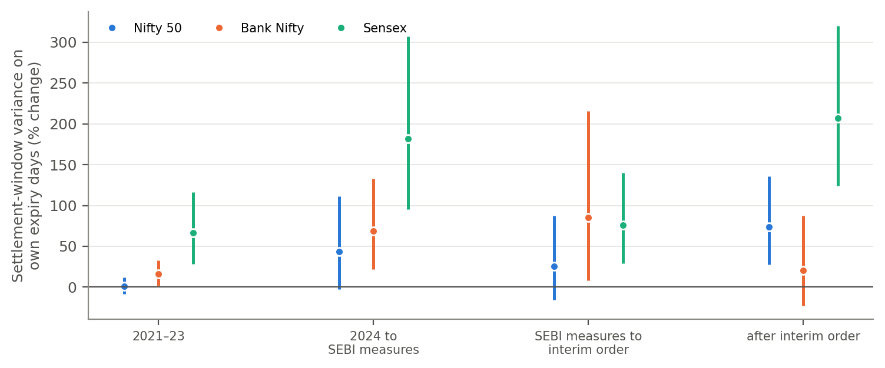

# Abstract {.unnumbered}

Index options in India expire on fixed weekdays, which the exchanges changed repeatedly between 2016 and 2025. Using these changes as natural experiments, with daily data for four indices (2014–2026) and one-minute data for three (2021–2026), this paper finds that options expiry raises volatility over the trading day as a whole little, if at all. Volatility in the 15:00–15:30 window that set the settlement price, however, is 53–67% higher on expiry days, and this effect moves with the expiry weekday. It remained large after SEBI's 2024 measures. Regulators should focus on how settlement prices are formed rather than on expiry frequency.

**Keywords:** options expiry; settlement price; intraday volatility; natural experiment; weekly index options; India

**JEL Classification:** G13, G14, G18

# Introduction

India's equity index options market has grown rapidly over the past decade, and the growth has been concentrated in very short-dated contracts. According to the National Stock Exchange's (NSE) end-of-day contract files, {{ACT_N24}} of all Nifty 50 option contracts traded in 2024 were traded on the day the contract expired, compared with {{ACT_N_EARLY}} in 2014–2018 (Supplementary Table S9 and Figure S1). Individual investors account for a large part of this activity, and regulatory studies report that about nine in ten individual traders in equity derivatives lose money [@sebi2024study; @sebi2025study]. Concern about expiry-day speculation led the Securities and Exchange Board of India (SEBI) to restrict each exchange to a single weekly index contract and to raise margins on expiry days from November 2024 [@sebi2024circular]. In July 2025, SEBI issued an interim order alleging that a trading firm had manipulated index levels on expiry days [@sebi2025janestreet].

These developments rest on a widely held view that expiry days destabilize the underlying market. The view is plausible but not obvious. Option writers who delta-hedge short positions trade in the direction of price moves as gamma rises near expiry, which can amplify volatility [@ni2021; @baltussen2021; @barbon2020]. Cash-settled contracts also create incentives to move the settlement price [@kumar1992; @hillion2004; @comertonforde2011]. Hedgers who are long gamma, by contrast, trade against price moves and can pin prices to strikes [@avellaneda2003; @ni2005; @golez2012]. Evidence from the recent growth of zero-days-to-expiry (0DTE) options in the United States is correspondingly mixed: market makers' net gamma is mostly positive and dampens intraday volatility [@dim2024], yet instrumented 0DTE volume raises volatility [@brogaard2023].

Evidence for India comes mainly from comparing expiry days with other days [@vipul2005; @agarwalla2013] or from a single change in the expiry calendar [@chhimwal2025]. Such comparisons are difficult to interpret. Expiry falls on a fixed weekday, and weekdays differ in volatility for reasons unrelated to derivatives, such as the timing of global news. A difference between expiry days and other days can therefore reflect the weekday rather than the expiry.

This paper exploits a feature of the Indian market that separates the two. Between 2016 and 2025 the exchanges changed the weekday on which index options expire many times (Table 1). Bank Nifty weekly options moved from Thursday to Wednesday in 2023 and were abolished in November 2024. Sensex options were relaunched with Friday expiries in 2023 and moved to Tuesday and then to Thursday in 2025. Nifty 50 options moved from Thursday to Tuesday in September 2025, on the same day that Sensex moved in the opposite direction. Most changes moved the expiry of one index while the calendars of the others stayed fixed, and public holidays moved individual expiries to the previous trading day. If expiry causes volatility, abnormal volatility should move with the expiry day.

The paper makes three contributions. First, it uses all of India's recent expiry-calendar changes as natural experiments in a difference-in-differences framework. To my knowledge, the 2024–2025 changes have not been studied before. The expiry calendar is reconstructed from the exchanges' rules and verified against exchange contract files. Second, the paper locates where in the trading day expiry matters. Volatility over the session as a whole changes little on expiry days, but volatility in the half hour whose average price determined the settlement value is 53% higher on weekly expiry days and 67% higher on monthly expiry days. This settlement-window effect rose on the new expiry weekday in all five calendar changes that introduced one, and it grows with the volume of expiring contracts. Third, the paper shows that the effect remained large after the regulatory measures of November 2024 and after the July 2025 interim order. Removing an expiry removes the settlement-window volatility on that day, but the volatility appears wherever contracts expire, which suggests that it is tied to the design of the settlement price rather than to the frequency of expiry.

The remainder of the paper is organized as follows. Section 2 reviews the literature and develops the hypotheses. Section 3 describes the data and Section 4 the methodology. Section 5 presents the results, Section 6 examines mechanisms and regulation, and Section 7 discusses implications and concludes.

# Literature Review and Hypotheses

## Expiration-day effects

Research on expiration-day effects began with the "triple witching hour" in the United States. Stoll and Whaley [-@stoll1987] found abnormal volume, higher volatility and price pressure in the last hour of trading on days when S&P 500 index futures expired, but not when only index options expired. After settlement moved from the closing to the opening price in 1987, these effects moved from the close to the open rather than disappearing [@stoll1991]. This shift is an early indication that the settlement mechanism, not expiry as such, determines where effects appear.

Evidence from other markets supports this interpretation. In Sweden, where settlement is based on a long averaging period, Alkebäck and Hagelin [-@alkeback2004] report higher cash-market volume but no price distortions on expiration days. In Hong Kong, where Hang Seng Index derivatives settle on an average of five-minute quotes, @chow2003 find a small negative price effect but no abnormal volume or reversals. In India, @vipul2005 finds abnormal volume and price effects in the underlying shares around the expiry of NSE derivatives, and Agarwalla and Pandey [-@agarwalla2013] show that the volatility of stocks with single-stock futures rises only in the last half hour of expiry day, the window used to compute the settlement price. Closer to this study, @chhimwal2025 examine the 2023 move of Bank Nifty expiries from Thursday to Wednesday and find that the volume and volatility of both the Nifty 50 and Bank Nifty rose after the change, while volatility connectedness between them fell. Jain and Kotha [-@jain2022] report that the introduction of weekly Nifty 50 options improved information absorption and reduced volatility persistence.

## Mechanisms: hedging, pinning and manipulation

Three mechanisms link options expiry to the underlying market. The first is hedging. Option market makers rebalance their delta hedges as prices move, and the sign of their net gamma determines whether this rebalancing amplifies or dampens price changes [@ni2021]. Because gamma is highest for near-the-money options close to expiry, hedging pressure peaks on expiry day and late in the session [@baltussen2021]. The second is pinning: when hedgers are net long gamma, or when large option writers benefit from a particular settlement price, prices can cluster at strike prices on expiration dates [@avellaneda2003; @ni2005; @golez2012]. The third is manipulation of the settlement price. Cash-settled contracts give traders with large positions an incentive to move the price on which settlement is based [@kumar1992], and closing prices are particularly vulnerable when they are set in a thin end-of-day market [@hillion2004; @comertonforde2011].

In India, all three mechanisms would be concentrated in the final half hour of the session. Until August 2026, the official closing value of an index was computed from the volume-weighted average prices of its constituents between 15:00 and 15:30, and this value was the settlement price of expiring index options. If expiry affects the underlying market, the effect should therefore be most visible in this window.

## Hypotheses

The literature implies opposing effects on volatility over the whole session, but a clear prediction for the settlement window. The paper tests the following hypotheses.

**H1.** Volatility over the whole trading session is higher on days when an index's own options expire.

**H2.** Volatility in the settlement window (15:00–15:30) is higher on days when an index's own options expire.

**H3.** When the expiry of an index's options moves to a different weekday, the abnormal volatility moves with it: it appears on the weekday that gains an expiry and disappears from the weekday that loses one.

**H4.** The expiry of options on another large index raises an index's volatility, because the major Indian indices share many constituent stocks.

In addition, the paper asks whether the expiry effect changed after SEBI's derivatives measures of November 2024 and after its interim order of July 2025.

# Data

## Sample and sources

The daily sample covers four indices from January 2014 to July 2026: the Nifty 50, the Nifty Bank (Bank Nifty), the BSE Sensex and the Nifty Midcap 50. Daily open, high, low and closing values are taken from Yahoo Finance. The Midcap 50 serves as the index least exposed to large-cap index options. It has no options of its own; its "own" expiries are those of the Nifty Midcap Select, a smaller NSE index of 25 mid-cap stocks drawn from the same universe, whose option market is small. The sample ends on 31 July 2026 because on 3 August 2026 NSE replaced the 30-minute average closing price with a closing auction [@nse2026casgolive], which changed how settlement prices are determined. Weekend special sessions, Diwali *Muhurat* evening sessions and incomplete records are removed. The final daily sample contains 12,312 index-days.

Intraday analysis uses one-minute index values for the Nifty 50 and Bank Nifty (May 2021 to 2 July 2026) and the Sensex (September 2022 to 2 July 2026) from a public dataset [@hf_minute], a total of 3,428 index-days with complete sessions. The settlement window is measured with the one-minute bars from 15:00 to 15:29, so it does not use the official closing value itself. Daily ranges rebuilt from the one-minute data correlate between 0.996 and 0.999 with the daily data. End-of-day NSE contract files (*bhavcopy*) for Nifty 50 and Bank Nifty options from 2014 to June 2026 [@hf_bhav] provide open interest and contracts traded by strike and expiry. Hourly Yahoo Finance data from October 2023 to September 2026 are used only for a first look at the closing auction.

## The expiry calendar

The expiry calendar of six index option products is reconstructed from exchange circulars [@nse2025expiry; @bse2025expiry; @sebi2024circular]. Weekly contracts expire on a fixed weekday, and monthly contracts on the last such weekday of the month. When the scheduled day is a holiday, contracts expire on the previous trading day. Supplementary Table S1 lists every rule, and Table 1 lists the changes used as natural experiments.

The reconstructed calendar is verified against the exchanges' own records. A day is an observed expiry day if a contract traded on its expiry date in NSE's contract files; when NSE labels a contract with a holiday, the observed expiry day is the contract's last trading day. On every day covered by the files between January 2014 and June 2026, the calendar matches all 444 Nifty 50 and 488 Bank Nifty expiry days with no mismatches; two further calendar expiry days (5 and 12 November 2020) fall in a gap in the files. For the Sensex, all 148 expiry dates in an independent option dataset (August 2023 to July 2026) are expiry days in the calendar; eight calendar expiry days are absent from that dataset, six of them at its end, where its coverage thins.

**Table 1.** Changes in the expiry calendar used as natural experiments

{{T1}}

*Note.* Changes to the expiry weekday of the indices' own options. The Sensex change applied from 1 January 2025; contracts already listed for Friday 3 January 2025 expired on that day. Further changes to monthly contracts, to Nifty Financial Services, Nifty Midcap Select and Bankex options, and holiday shifts also enter the regressions through the expiry indicators (Supplementary Table S1). After the Bank Nifty change in September 2023, the monthly contract remained on the last Thursday until February 2024.

## Volatility measures

Volatility over the whole session is measured with the range-based estimator of @garman1980,

$$\sigma^2_{GK,it} = 0.5\,(\ln H_{it} - \ln L_{it})^2 - (2\ln 2 - 1)(\ln C_{it} - \ln O_{it})^2,$$

where *O*, *H*, *L* and *C* are the opening, high, low and closing values of index *i* on day *t*. With one-minute data, session volatility is measured as realized variance from five-minute returns, and settlement-window volatility as realized variance from one-minute returns between 15:00 and 15:30. All variances are expressed in squared percent. Because variance is highly right-skewed, all variance measures enter the regressions in logs, so a coefficient *b* corresponds to a change in variance of 100(*e*^*b*^ − 1) percent.

Table 2 reports descriptive statistics. Daily returns are negatively skewed and fat-tailed, as is typical of equity indices. Augmented Dickey–Fuller tests reject a unit root for all log variance series. The table also previews the main result: on expiry days, the median share of session variance that falls in the settlement window rises from 7.7% to 17.1% for the Sensex and from 6.8% to 9.6% for Bank Nifty.

**Table 2.** Descriptive statistics

{{T2}}

*Note.* Returns are daily close-to-close log returns in percent. Kurtosis is not excess kurtosis. ADF statistics include a constant, with lag length chosen by the Akaike information criterion; the 1% critical value is about −3.43. For the Midcap 50, "own expiry days" are expiry days of Nifty Midcap Select options.

# Methodology

## Fixed-effects specification

For index *i* on trading day *t*, the baseline specification is

$$y_{it} = \beta_w\,OwnWeekly_{it} + \beta_m\,OwnMonthly_{it} + \gamma_1\,OtherLarge_{it} + \gamma_2\,OtherSmall_{it} + \alpha_{i,d(t)} + \delta_{i,w(t)} + \varepsilon_{it}, \qquad (1)$$

where *y*~*it*~ is a log variance measure. *OwnWeekly*~*it*~ and *OwnMonthly*~*it*~ indicate that a weekly or monthly contract on the index's own options expires on day *t*. *OtherLarge*~*it*~ indicates the expiry of options on another of the Nifty 50, Bank Nifty and Sensex, and *OtherSmall*~*it*~ the expiry of options on smaller indices. *α*~*i*,*d*(*t*)~ are index-by-weekday fixed effects, which absorb each index's usual weekday pattern, and *δ*~*i*,*w*(*t*)~ are index-by-week fixed effects, which absorb the level of volatility in each week.

With these fixed effects, the expiry coefficients are identified only by days whose expiry status differs from what is usual for their weekday within the same index, that is, by the calendar changes and holiday shifts. Equation (1) is therefore a difference-in-differences design in which treatment switches on and off at different times for different index–weekday cells. Standard errors are clustered by calendar week, which allows for arbitrary correlation across indices and days within a week. The fixed effects are absorbed by alternating projections [@guimaraes2010; @correia2016].

The identifying assumption is that, without the calendar change, volatility on the weekday gaining or losing an expiry would have evolved in parallel with the index's other weekdays. Robustness checks relax this assumption by adding weekday-by-year fixed effects common to all indices and, in the strictest version, date fixed effects. With date fixed effects, the comparison is purely across indices on the same day, so the estimate measures the effect of an index's own expiry net of spillovers to the other indices.

## Event studies

Each calendar change is also examined separately. For a change on date *D* affecting index *i*, a window of 26 weeks on either side is formed and cut at any other change to the same product's rules. Within the window,

$$y_{t} = \theta_g\,(Gain_{d(t)} \times Post_t) + \theta_l\,(Lose_{d(t)} \times Post_t) + \alpha_{d(t)} + \delta_{w(t)} + \varepsilon_t, \qquad (2)$$

where *Gain* and *Lose* indicate the weekday that gains or loses an expiry and *Post*~*t*~ indicates days on or after *D*. A stacked version pools the changes with event-specific weekday and week fixed effects. This avoids the comparisons between early- and late-treated units that bias two-way fixed-effects estimators when treatment is staggered [@goodmanbacon2021; @dechaisemartin2020; @cengiz2019].

## Randomization inference

As a design-based test [@young2019], equation (1) is re-estimated under 1,000 placebo calendars. Each placebo keeps the dates of every rule change but assigns the expiry weekdays at random, keeping weekly and monthly contracts on a common weekday whenever they shared one. The randomization *p*-value is (1 + *k*)/1,001, where *k* is the number of placebo estimates at least as large in absolute value as the estimate under the true calendar; its smallest possible value is 0.001.

# Results

## Volatility over the whole session (H1)

Panel A of Table 3 reports estimates of equation (1) for whole-session volatility from daily data. Pooled across the four indices, weekly expiry days are no more volatile than other days (*β̂*~w~ = −0.024, s.e. 0.032), and monthly expiry days are slightly but insignificantly more volatile (*β̂*~m~ = 0.055, s.e. 0.049). The 95% confidence intervals rule out increases in variance above 4.0% on weekly expiry days and above 16.3% on monthly expiry days. Only the Nifty 50's weekly expiry days stand out, and they are about 10% *calmer* than other days (*p* = 0.047), an estimate that is not significant after a Holm adjustment for testing four indices (*p* = 0.19). Panel B confirms these results with five-minute realized variance from 2021: the pooled weekly coefficient is 0.019 (s.e. 0.036). Results are similar for other range-based and close-to-close measures (Supplementary Table S2). H1 is therefore not supported: expiry raises whole-session volatility little, if at all.

**Table 3.** Expiry-day effects on log variance

{{T3}}

*Note.* Estimates of equation (1). Pooled regressions include index-by-weekday and index-by-week fixed effects; regressions for a single index include weekday and week fixed effects. All regressions also include an indicator for the expiry of options on smaller indices (not shown). For the Midcap 50, own expiries are those of Nifty Midcap Select options. Standard errors clustered by calendar week are in parentheses. \*, \*\* and \*\*\* denote significance at the 10%, 5% and 1% levels.

## Volatility in the settlement window (H2 and H4)

Panel C of Table 3 shows where expiry does matter. In the 15:00–15:30 window, variance is 53% higher on weekly expiry days (*β̂*~w~ = 0.425, s.e. 0.043) and 67% higher on monthly expiry days (*β̂*~m~ = 0.511, s.e. 0.066). The effect is largest for the Sensex (146% for weekly and 127% for monthly expiries) and clear for Bank Nifty (34% and 41%). For the Nifty 50 it is significant for monthly expiries over the full minute-data sample; Section 6 shows that the Nifty 50 effect was close to zero in 2021–2023 and became significant after July 2025. The expiry of options on another large index raises settlement-window variance by 14% (*γ̂*~1~ = 0.130, s.e. 0.038), which supports H4. No such spillover is visible in whole-session volatility.

Because the Sensex effect is large, the pooled estimate was re-computed without each index in turn (Supplementary Table S10). Without the Sensex, settlement-window variance is still 20% higher on weekly and 41% higher on monthly expiry days (coefficients 0.18 and 0.34, both *p* < 0.001). H2 is therefore supported, and the result does not depend on a single index. The Sensex result may reflect the size of Sensex options relative to trading in its 30 constituent stocks on BSE, where the closing value is computed, but the data do not allow this explanation to be tested directly.

## Natural experiments (H3)

Figure 1 shows the six calendar changes covered by the one-minute data. Each panel plots settlement-window variance on each weekday relative to the rest of its week, for the 26 weeks before and after the change. In each of the five changes that introduced a new expiry weekday, settlement-window volatility rose on that weekday. The Sensex provides three such episodes: Friday on its relaunch in May 2023, Tuesday from January 2025 and Thursday from September 2025.

{width=100%}

Table 4 reports the event-by-event estimates of equation (2). The settlement-window variance on the new weekday rose in all five changes that introduced a new expiry weekday, four of them significantly; the exception is Bank Nifty's Wednesday in September 2023 (0.33, *p* = 0.10). It fell in four of the five changes that removed an expiry weekday, three of them significantly. The one rise, on Nifty's Thursday in September 2025, is expected: the Sensex expiry moved to Thursday on the same day the Nifty expiry left it. Stacking the six changes, the weekday that gains an expiry experiences a 65% rise in settlement-window variance (*θ̂*~g~ = 0.50, s.e. 0.09), and the weekday that loses one a 31% fall (*θ̂*~l~ = −0.37, s.e. 0.10). Controlling for the expiry of other large indices within the event windows, which accounts for the September 2025 swap, strengthens both estimates (0.56 and −0.44; Supplementary Table S10). The event-time profile is flat before the changes and rises immediately after them (Supplementary Figure S2). H3 is supported for the settlement window.

For the whole session, gaining an expiry raises five-minute realized variance by a modest 15% (*p* = 0.04), and losing one has no detectable effect. Over the eight major changes in the daily data, the corresponding estimates are 0.15 (*p* = 0.07) and −0.02, and the weekday profiles do not follow the calendar consistently (Supplementary Figure S3). Modest whole-session effects therefore cannot be excluded, but they are small relative to the settlement-window effect.

**Table 4.** Natural experiments: change in log variance after each calendar change

{{T4}}

*Note.* Estimates of equation (2) within ±26 weeks of each change, with weekday and week fixed effects. "New weekday" is the weekday that gains an expiry; "old weekday" the weekday that loses one. Whole session: log Garman–Klass variance (^a^ five-minute realized variance). One-minute data begin in May 2021 (Sensex: September 2022). Standard errors clustered by week in parentheses. \*, \*\* and \*\*\* denote significance at the 10%, 5% and 1% levels.

## Robustness

Table 5 summarizes the robustness checks. The settlement-window estimates change little when weekday-by-year fixed effects are added, with Driscoll–Kraay standard errors [@driscoll1998], with controls for pre- and post-holiday sessions, or with indicators for the days before and after expiry. With date fixed effects the estimates fall to about 0.25 but remain highly significant, which shows that an index's own expiry raises its settlement-window volatility more than it raises that of other indices on the same day. The effect is present in both halves of the window and already in the preceding quarter-hour, consistent with positions being adjusted ahead of settlement. None of the 1,000 placebo calendars produces a settlement-window estimate as large as the true one (*p* ≤ 0.001), whereas the whole-session estimates are typical of placebo calendars (*p* = 0.48 and 0.22; Supplementary Figure S4).

One-minute returns contain market microstructure noise, which could itself be higher on busy expiry days. When the settlement window is measured with five-minute returns, the effect is smaller but remains significant: 21% for weekly and 59% for monthly expiries (coefficients 0.19 and 0.47; Supplementary Table S10).

The whole-session estimates are stable when 2020 is excluded and when the sample starts in 2017, after which opening prices in the daily data are cleaner. The one exception is the comparison with the Midcap 50 on the same day, in which monthly expiry days appear more volatile (0.179). Mid-caps are calmer than usual when large-index options expire (Table 3, Panel A), so this comparison partly reflects a shift of activity toward large-cap stocks rather than higher large-cap volatility.

**Table 5.** Robustness of the expiry effects

{{T5}}

*Note.* Coefficients on own weekly and own monthly expiry. Whole session: daily data 2014–2026, log Garman–Klass variance. 15:00–15:30: one-minute data 2021–2026. Date fixed effects compare indices on the same day. Placebo calendars keep the dates of all rule changes and assign weekdays at random; 0.001 is the smallest attainable *p*-value. Standard errors clustered by week in parentheses unless stated. \*, \*\* and \*\*\* denote significance at the 10%, 5% and 1% levels.

# Mechanisms and Regulation

## Timing within the day and trading intensity

Figure 2 estimates equation (1) separately for realized variance in each 15-minute slot of the session. The expiry effect is close to zero at the open, moderate during the day, and rises sharply in the afternoon. It peaks in 15:00–15:15, the first half of the settlement window, at 57% for weekly and 68% for monthly expiries. Expiries of other large indices matter mainly in the same quarter-hour. The slot estimates describe a typical slot; because the open accounts for much of the day's variance, moderate effects in individual slots add up to little in the whole-session measure. The profile is consistent with hedging and position adjustment directed at the settlement price, and less consistent with information arriving on expiry days, which would also raise volatility at the open.

{width=100%}

The effect also grows with trading in the expiring contracts. For the Nifty 50 and Bank Nifty, whose contract files are available, a one-standard-deviation increase in the number of expiring contracts traded on an expiry day raises settlement-window variance by a further 23% (coefficient 0.21, s.e. 0.05; Supplementary Table S10).

## Pinning and reversals

Two tests examine pinning (Supplementary Table S3). Official closing values fall near a strike price only slightly more often on expiry days than on other days, and the difference is significant only for Bank Nifty's 100-point strikes (22.8% against 19.9%). On expiry days the index does not move toward the strike with the largest open interest at the previous close; if anything, the Nifty 50 moves away from it (*p* = 0.04). Unlike the clustering of US stock prices at strikes documented by @ni2005, Indian index levels are not systematically pinned, which suggests that hedgers in this market are not predominantly long gamma.

SEBI's interim order described buying index stocks early on expiry days and selling them later in the session [@sebi2025janestreet]. In regressions of the return from 15:00 to 15:30 on the return from the open to 15:00, interacted with expiry, the last half hour reverses about 9% of the earlier move on Bank Nifty expiry days between January 2023 and March 2025 (−0.094, s.e. 0.035), but not on other days (Supplementary Table S4). No such pattern appears for other indices or periods. Because this sample was chosen to match the period of the allegations, the result is suggestive only, and it cannot identify any trader.

## Did regulation change the effect?

Figure 3 and Supplementary Table S5 estimate the settlement-window effect separately for four periods. Within short periods an index's expiry weekday rarely changes, so these estimates compare indices with each other on the same weekday and week. The weekly-expiry effect was 0.19 in 2021–2023 and 0.60 in 2024. Between SEBI's November 2024 measures and its July 2025 interim order it was lower but still significant (0.49), and after the interim order it was 0.92. Because the set of indices with weekly expiries changed over time, and the period after the interim order includes the September 2025 calendar changes, these comparisons are descriptive. They show no evidence that the November 2024 measures, which targeted the number of expiries and margins, eliminated settlement-window volatility. A first look at the closing auction introduced in August 2026, based on about two months of hourly data, shows that the expiry effect in the last hourly bar was, if anything, larger after the change, mainly for the Sensex (Supplementary Table S7). The hourly bar may not capture the auction price itself, and the evidence is too limited for conclusions.

{width=100%}

Two further results are reported in the supplementary material. Weeks in which an index has weekly options show 5.5% higher total variance in a simple comparison, but the difference disappears with index-specific trends (Supplementary Table S8). Adding the expiry calendar to a heterogeneous autoregressive (HAR) volatility model [@corsi2009] makes out-of-sample forecasts of next-day volatility slightly worse, significantly so for the Nifty 50 and Sensex (Supplementary Table S6). Both results are consistent with an effect confined to a short window late in the session.

# Discussion and Conclusion

## Discussion

The results reconcile two views that appear to conflict. The popular view that expiry days are volatile is correct for the half hour that determines the settlement price. The view that expiry does not destabilize the market is broadly correct for the trading day as a whole. On normal days the settlement window accounts for less than a tenth of session variance (Supplementary Table S11), so even a large increase in that window changes daily volatility measures little.

The findings are consistent with the international evidence that settlement design determines where expiration effects appear [@stoll1991; @alkeback2004; @chow2003]. They extend the evidence of Agarwalla and Pandey [-@agarwalla2013] for Indian single-stock futures to index options in the period of weekly expiries. They also add to the evidence of @chhimwal2025 on the 2023 Bank Nifty change, by showing that the settlement-window effect follows the calendar across the recent changes. The concentration of the effect in the settlement window, its growth with the volume of expiring contracts and the absence of pinning are consistent with hedging and position adjustment aimed at the settlement price. The design cannot distinguish legitimate hedging from manipulation.

## Implications

The findings have implications for regulators, exchanges and market participants. For regulators, the evidence on daily volatility does not by itself justify limiting the number or frequency of expiries. The 2024 measures were motivated mainly by investor protection, and the results do not speak to that objective. If market stability is the concern, the relevant lever is the design of the settlement price, for example a closing auction, a longer or volume-weighted averaging window, or closer surveillance of trading in the final minutes. For exchanges, the closing auction introduced in August 2026 is the natural instrument, and its effect on expiry-day closing volatility should be evaluated once enough data are available. For investors and risk managers, expiry days need not be treated as high-risk days overall, but positions and stop-loss orders exposed to prices near the close of expiry days carry markedly higher risk.

## Limitations and future research

The study has several limitations. The Nifty 50, Bank Nifty and Sensex share many constituent stocks, so the effects of an index's own expiry and of spillovers from other indices cannot be fully separated. The one-minute data begin in 2021, and the most recent calendar changes have only six to ten months of data after them. Realized variance does not distinguish price pressure that later reverses from the incorporation of information, and one-minute returns contain microstructure noise, although the effect remains with five-minute returns. The size of the effect varies considerably across indices, and the reasons for the large Sensex effect remain to be established. Future research could use stock-level and trader-level data to identify who trades in the settlement window, and could evaluate the closing auction once a longer sample is available.

## Conclusion

India's repeated changes to its index options expiry calendar provide a rare natural experiment on whether options expiry destabilizes the underlying market. The evidence shows that it does so only narrowly. Expiry days are not materially more volatile over the whole session, but the half hour that set the settlement price is 53–67% more volatile, and this effect moves with the expiry day when the calendar changes. Policy aimed at market stability should therefore focus on how settlement prices are formed rather than on how often contracts expire.
