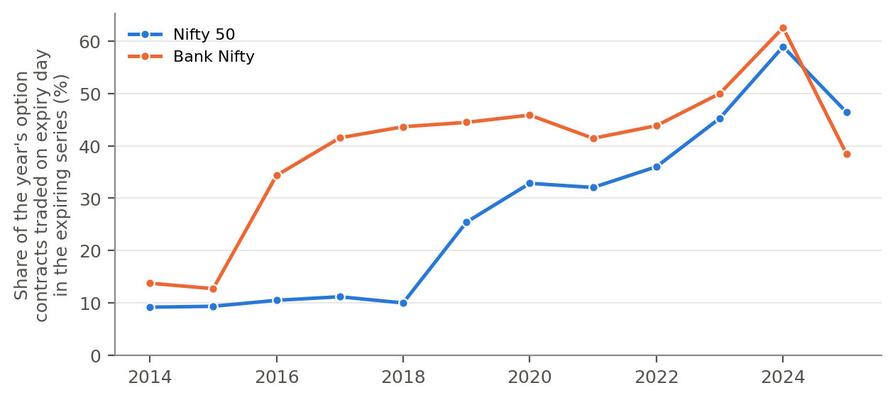
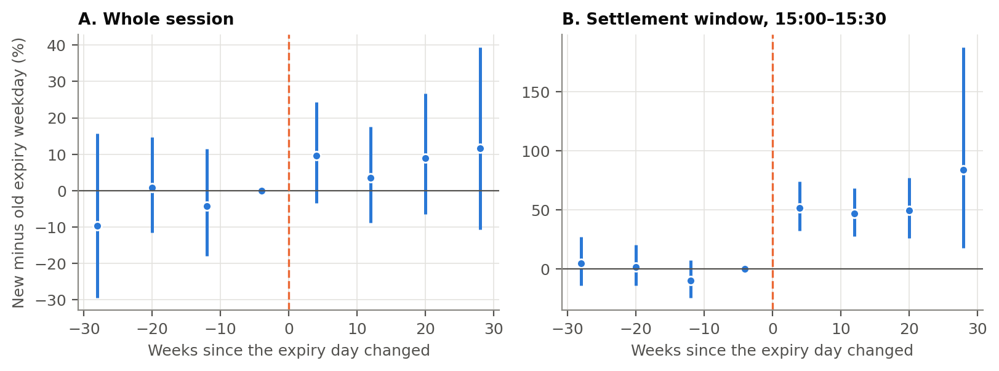
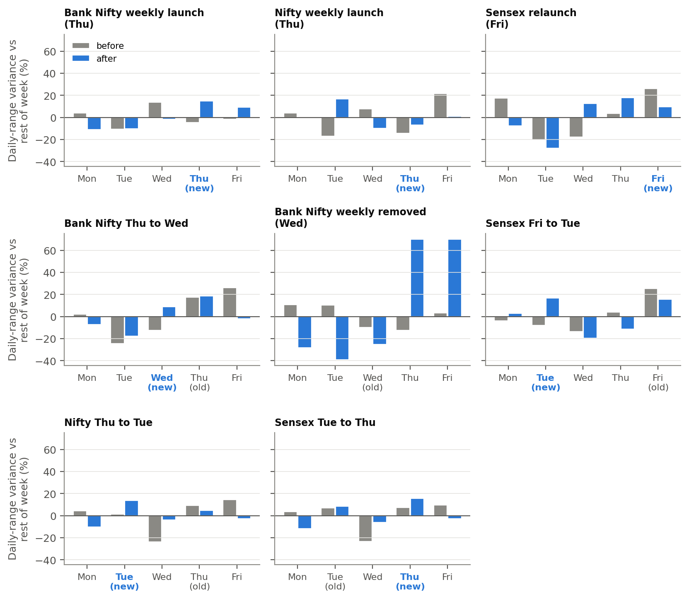
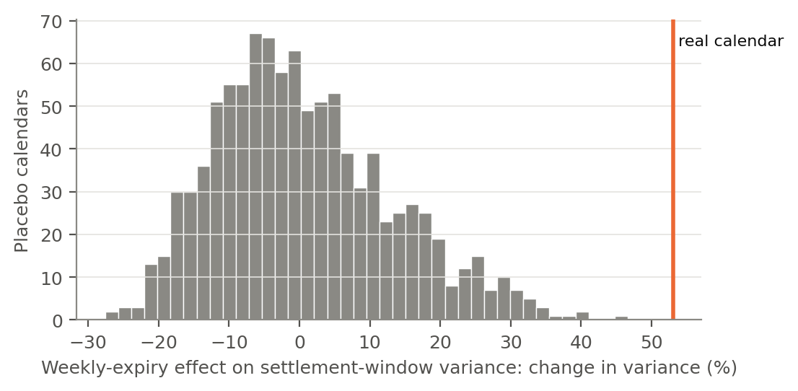

This supplement reports the full expiry calendar and additional results referred to in the main text. All estimates use the specifications of the main text unless stated otherwise. Standard errors clustered by calendar week are in parentheses; \*, \*\* and \*\*\* denote significance at the 10%, 5% and 1% levels.

# S1. Expiry rules of Indian index options, 2014–2026

**Table S1.** Expiry rules by product

{{S1}}

*Note.* NIFTY, BANKNIFTY, FINNIFTY (Nifty Financial Services) and MIDCPNIFTY (Nifty Midcap Select) trade on NSE; SENSEX and BANKEX on BSE. Each rule applies from its start date until the next rule of the same product. If the scheduled day is a holiday, contracts expire on the previous trading day. In the week of a monthly expiry, no separate weekly contract is listed.

# S2. Alternative whole-session volatility measures

**Table S2.** Pooled estimates of equation (1) for alternative outcomes (daily data, 2014–2026)

{{S2}}

*Note.* Parkinson and Rogers–Satchell are range-based variance estimators [@parkinson1980; @rogers1991]; open-to-close is the squared session return; close-to-close adds the squared overnight gap; overnight gap is the squared return from the previous close to the open.

# S3. Pinning

**Table S3.** Closing values near strikes, and moves toward the largest open-interest strike

{{S3}}

*Note.* Top panel: share of official closing values whose distance to the nearest strike (a multiple of the strike step) is less than 10% of the step. Without pinning this share is about 0.20. The coefficients are from linear-probability versions of equation (1) for each index. Bottom panel (Nifty 50 and Bank Nifty, NSE contract files 2014 – June 2026): change during the day in the distance, in percent of the index level, between the index and the strike with the largest open interest (calls plus puts) at the previous close in the nearest-expiry series. Positive values mean the index moved away from that strike. The difference controls for the distance at the open, with weekday and year fixed effects.

# S4. Intraday reversals

**Table S4.** Reversal of earlier moves on expiry days (one-minute data)

{{S4}}

*Note.* First column: coefficient on the interaction of the morning return (09:15–12:30) with own expiry in a regression of the afternoon return (12:30–15:30). Second column: coefficient on the interaction of the return from the open to 15:00 with own expiry in a regression of the return from 15:00 to 15:30. Negative values indicate stronger reversal on expiry days. The final row covers the period of the allegations in SEBI's interim order of 3 July 2025.

# S5. Settlement-window effects by period

**Table S5.** Expiry effects on 15:00–15:30 log realized variance by period

{{S5}}

*Note.* Top panel: pooled estimates. Bottom panel: own-expiry effect for each index (number of own expiry days in brackets). Both compare indices with each other on the same weekday and week (index-by-week and common weekday fixed effects). SEBI's measures took effect on 20 November 2024; the interim order is dated 3 July 2025. One-minute data start in May 2021, so the first period covers 2021–2023.

# S6. Forecasting next-day volatility

**Table S6.** Does the expiry calendar improve volatility forecasts?

{{S6}}

*Note.* Walk-forward forecasts of next-day close-to-close variance from January 2018 to July 2026, with an expanding estimation window re-fitted every 22 trading days. The HAR model [@corsi2009] uses log variance over the last day, week and month and the calendar days to the next session, and is estimated with the Gamma loss, which is consistent with the QLIKE criterion [@patton2011]. Diebold–Mariano tests [@diebold1995] use Newey–West standard errors. "+ calendar" adds the next day's own weekly, own monthly and other-large-index expiry indicators, which are known in advance. Lower QLIKE is better.

# S7. The closing auction: a first look

**Table S7.** Expiry effects in the hourly bar starting at 15:15 (the last bar of the session), before and after the closing auction

{{S7}}

*Note.* Log Parkinson variance of the hourly bar starting at 15:15, October 2023 – September 2026 (Yahoo Finance). "After 3 Aug 2026" covers about two months. The hourly bar may not capture the auction price itself, and few expiry days fall after the change, so the test has little power.

# S8. Total weekly volatility

**Table S8.** Weekly options and total weekly variance

{{S8}}

*Note.* Index-week panel. The outcome is the log of average daily variance in the week; the regressor indicates that the index's own options had weekly contracts. Index and week fixed effects; the last row adds index-specific linear trends.

# S9. Expiry-day option trading

**Table S9.** Share of each year's option contracts traded on expiry day in the expiring series (%)

{{S9}}

*Source.* NSE F&O contract files.

# S10. Additional robustness checks

**Table S10.** Additional checks of the settlement-window result

{{S10}}

*Note.* Stacked events: equation (2) pooled over the six calendar changes with one-minute data, without and with a control for the expiry of other large indices. Leave-one-out: pooled equation (1) without the named index. Five-minute returns: settlement-window realized variance from the six five-minute returns between 15:00 and 15:30. Dose–response (Nifty 50 and Bank Nifty, to June 2026): own expiry interacted with the standardized log number of contracts traded in the expiring series on the expiry day.

# S11. Share of session variance in the settlement window

**Table S11.** Mean share of session realized variance in 15:00–15:30 (%)

{{S11}}

# S12. Additional figures

{width=75%}

**Figure S1.** Share of each year's option contracts traded on expiry day in the expiring series, Nifty 50 and Bank Nifty options.

{width=100%}

**Figure S2.** Event-time profile, stacked over the six calendar changes with one-minute data: difference between the new and the old expiry weekday in eight-week bins (the bin before the change is the reference), with 95% confidence intervals. A: whole session (five-minute realized variance). B: 15:00–15:30.

{width=100%}

**Figure S3.** Whole-session volatility (log Garman–Klass variance) on each weekday relative to the rest of its week, 26 weeks before and after the eight major calendar changes. Unlike the settlement window (main text, Figure 1), the weekday profile does not consistently follow the expiry day.

{width=70%}

**Figure S4.** Distribution of the weekly-expiry effect on 15:00–15:30 variance under 1,000 placebo calendars; the vertical line is the estimate under the true calendar.
